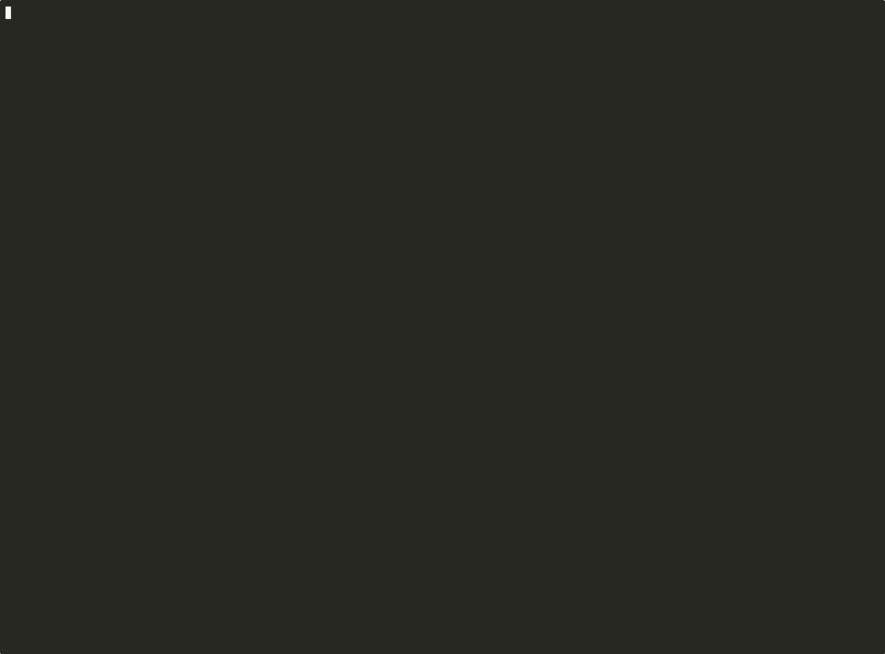

# nihostt

[](https://github.com/ekhodzitsky/nihostt/actions/workflows/ci.yml)
[](https://crates.io/crates/nihostt)
[](https://github.com/ekhodzitsky/nihostt/pkgs/container/nihostt)
[](LICENSE)

> **Local Japanese speech-to-text server.** On-device, real-time, privacy-first — powered by ReazonSpeech-k2-v2 via ONNX Runtime. No cloud APIs, no API keys, no data leaves your machine.



```bash
# Install from source & run
git clone https://github.com/ekhodzitsky/nihostt.git
cd nihostt
cargo build --release
./target/release/nihostt download && ./target/release/nihostt serve
```

## Why nihostt?

| | nihostt | Google Cloud Speech | Azure Speech | Amazon Transcribe |
|---|---|---|---|---|
| **Privacy** | ✅ 100% on-device | ❌ Cloud upload | ❌ Cloud upload | ❌ Cloud upload |
| **Offline** | ✅ Works without internet | ❌ No | ❌ No | ❌ No |
| **Latency** | ✅ ~200ms (local) | ~500–2000ms | ~500–2000ms | ~1000–3000ms |
| **Cost** | ✅ Free forever | $0.024/min | $1.0/hour | $0.024/min |
| **Japanese CER** | **~1.1%**¹ | ~5–8% | ~4–7% | ~5–9% |

¹ Clean speech subset (9 clips). Full local benchmark (309 clips): 8.04% — see Benchmarks section below.

*Benchmark: 309 clips — Tatoeba (9 clean native speech) + Tatoeba Extended (200 colloquial phrases) + JSUT basic5000 (100 read speech). Character error rate after whitespace/punctuation normalization. Clean subset: ~1.1%. Full set: 8.04%. See [`tests/benchmark.rs`](tests/benchmark.rs).*

## Features

- 🎙️ **Streaming recognition** — WebSocket with live partial/final transcripts
- 📁 **File upload** — REST endpoint for batch transcription (WAV, MP3, M4A, FLAC, OGG)
- 📡 **SSE streaming** — Server-Sent Events for progressive file transcription
- 🧠 **SOTA accuracy** — ReazonSpeech-k2-v2 (Zipformer RNN-T, 159M params)
- ⚡ **INT8 quantization** — ~155 MB model, ~350 MB RAM on mobile
- 🔒 **Privacy by default** — loopback-only bind, origin checks, no telemetry
- 🛡️ **Production controls** — rate limiting, readiness, metrics, graceful drain
- 📱 **Android FFI** — build `libnihostt.so` for on-device mobile STT
- 🗣️ **Speaker diarization** — optional feature-gated speaker ID tracking

## Quick Start

```bash
# 1. Install (choose one)
cargo install nihostt          # from crates.io
# or: brew tap ekhodzitsky/nihostt && brew install nihostt
# or: git clone ... && cargo build --release

# 2. Download model (~155 MB INT8, one-time)
nihostt download

# 3. Start server
nihostt serve

# 4. Transcribe a file
nihostt transcribe recording.wav
```

### WebSocket streaming example

```javascript
const ws = new WebSocket('ws://127.0.0.1:9876/v1/ws');

ws.onmessage = (event) => {
  const msg = JSON.parse(event.data);
  if (msg.type === 'partial') console.log('partial:', msg.text);
  if (msg.type === 'final')   console.log('final:  ', msg.text, 'speaker:', msg.speaker_id);
};

ws.onopen = async () => {
  // Server expects raw PCM16 @ 16 kHz mono.
  // MediaRecorder outputs encoded audio (WebM/Opus), so use AudioContext
  // for raw samples. See examples/ for full AudioWorklet-based clients.
  const audioCtx = new AudioContext({ sampleRate: 16000 });
  const stream   = await navigator.mediaDevices.getUserMedia({ audio: true });
  const source   = audioCtx.createMediaStreamSource(stream);
  const processor = audioCtx.createScriptProcessor(4096, 1, 1);

  processor.onaudioprocess = (e) => {
    const f32 = e.inputBuffer.getChannelData(0);
    const pcm16 = new Int16Array(f32.length);
    for (let i = 0; i < f32.length; i++) {
      pcm16[i] = Math.max(-1, Math.min(1, f32[i])) * 0x7FFF;
    }
    ws.send(pcm16.buffer);
  };

  source.connect(processor);
  processor.connect(audioCtx.destination);
};
```

### REST transcription example

```bash
# Health check
curl http://127.0.0.1:9876/health
# → {"status":"ok","model":"reazonspeech-k2-v2","language":"ja"}

# Transcribe a file
curl -F file=@recording.wav http://127.0.0.1:9876/v1/transcribe
# → {"text":"こんにちは","language":"ja","confidence":0.92}
```

See [`examples/`](examples/) for Python, Kotlin, Go, Bun, and JavaScript clients.

## Architecture

```
┌─────────────┐     WebSocket     ┌─────────────────────────────┐
│   Browser   │◄─────────────────►│  axum server (Rust)         │
│   / Mobile  │     REST/SSE      │  ├── VAD (Silero)            │
└─────────────┘                   │  ├── Session pool (4× ONNX)  │
                                  │  └── Streaming pipeline      │
                                  └─────────────────────────────┘
                                           │
                                           ▼
                                  ┌─────────────────────────────┐
                                  │  ONNX Runtime               │
                                  │  ├── Encoder (INT8, ~155MB) │
                                  │  ├── Decoder (~4MB)         │
                                  │  └── Joiner (~2.6MB)        │
                                  └─────────────────────────────┘
```

## Benchmarks

Run locally on Apple M1 Pro:

```bash
cargo test --test benchmark -- --ignored
```

| Dataset | Clips | Type | CER | Notes |
|---|---|---|---|---|
| Tatoeba JA (original) | 9 | Clean native speech | **~1.1%** | See [`tests/fixtures/tatoeba/`](tests/fixtures/tatoeba/) |
| Tatoeba JA (extended) | 200 | Colloquial phrases | included in overall | Kanji/kana variants (e.g. "まことに" vs "誠に") |
| JSUT basic5000 (sample) | 100 | Read speech, single speaker | included in overall | See [`tests/fixtures/jsut/`](tests/fixtures/jsut/) |
| **Combined** | **309** | **Real native speech** | **8.04%** | **415/5160 chars, punctuation-normalized** |
| Synthetic TTS | — | `say -v Kyoko` | 24.19% | Higher due to acoustic mismatch |

The extended set includes challenging short utterances where the model sometimes outputs kana instead of kanji. JSUT covers longer read sentences with domain-specific vocabulary. Many "errors" are orthographic variants rather than pronunciation failures. CER is computed after stripping whitespace and punctuation for a fairer comparison. See `tests/benchmark.rs` for methodology.

## Installation

### macOS (Homebrew)

```bash
brew tap ekhodzitsky/nihostt
brew install nihostt
```

### From source

```bash
git clone https://github.com/ekhodzitsky/nihostt.git
cd nihostt
cargo build --release
./target/release/nihostt serve
```

### Docker

```bash
# CPU (any platform)
docker build -t nihostt .
docker run -p 9876:9876 nihostt

# CUDA (Linux, requires NVIDIA Container Toolkit)
docker build -f Dockerfile.cuda -t nihostt-cuda .
docker run --gpus all -p 9876:9876 nihostt-cuda

# Baked image (model included at build time, ~350 MB)
docker build --build-arg NIHOSTT_BAKE_MODEL=1 -t nihostt:baked .
```

### Kubernetes

```bash
kubectl apply -f k8s/
```

Includes:
- `Deployment` with init-container for model download
- `Service` (ClusterIP)
- Liveness probe (`/health`) and readiness probe (`/ready`)

## API

| Method | Endpoint | Description |
|---|---|---|
| `GET` | `/health` | Liveness check (always returns 200 if process is up) |
| `GET` | `/ready` | Readiness check (200 when inference pool has capacity, 503 when saturated) |
| `GET` | `/metrics` | Optional Prometheus metrics when `--metrics` is enabled |
| `POST` | `/v1/transcribe` | Upload audio file, get JSON transcript with optional `confidence` |
| `POST` | `/v1/transcribe/stream` | Upload audio file, get SSE stream |
| `WS` | `/v1/ws` | Real-time streaming with partial/final |

See [`docs/openapi.yaml`](docs/openapi.yaml) for REST/SSE spec and [`docs/asyncapi.yaml`](docs/asyncapi.yaml) for WebSocket protocol. Full CLI reference is in [`docs/cli.md`](docs/cli.md).

## Android / Mobile

Build `libnihostt.so` for Android:

```bash
cargo ndk -t arm64-v8a -o ./android/app/src/main/jniLibs \
  build --release --features ffi
```

See [`ANDROID.md`](ANDROID.md) for full integration guide.

## Speaker Diarization

Identify **who spoke when** in multi-speaker audio. Enabled via the `diarization` Cargo feature.

```bash
# Build with diarization support
cargo build --release --features diarization

# Download models (includes WeSpeaker ResNet34 ONNX automatically)
./target/release/nihostt download

# Start server — speaker_id appears in WebSocket/SSE Final messages
./target/release/nihostt serve
```

When diarization is enabled, every `final` transcript includes a `speaker_id` field:

```json
{"type":"final","text":"こんにちは","speaker_id":0}
```

The speaker embedding model (~26 MB, WeSpeaker ResNet34) is auto-downloaded on first run. You can also place a custom `ecapa_tdnn.onnx` in `~/.nihostt/models/` — it will be used in priority if present.

## Model

| File | Size | Description |
|---|---|---|
| `encoder-epoch-99-avg-1.onnx` | ~155 MB (INT8) | Quantized Zipformer encoder |
| `decoder-epoch-99-avg-1.onnx` | ~4.4 MB | LSTM decoder |
| `joiner-epoch-99-avg-1.onnx` | ~2.6 MB | RNN-T joiner |
| `tokens.txt` | ~46 KB | BPE vocabulary (5224 tokens) |
| `wespeaker_resnet34.onnx`¹ | ~26 MB | Speaker embedding (diarization) |

¹ Auto-downloaded with `nihostt download` when built with `--features diarization`.

Base models are from [HuggingFace](https://huggingface.co/reazon-research/reazonspeech-k2-v2).
Downloads are pinned to immutable model revisions and verified with SHA-256.
If a cached model file fails verification, nihostt removes it and downloads a
fresh copy before serving requests.

## Production Defaults

- Server binds `127.0.0.1` by default. Use `--bind-all --host 0.0.0.0` only behind Docker, a reverse proxy, or a trusted network boundary.
- Browser cross-origin requests are denied unless the origin is loopback, listed with `--allow-origin`, or `--cors-allow-any` is set.
- Per-IP rate limiting is on by default: `--rate-limit-per-minute 60`, `--rate-limit-burst 10`. Set the rate to `0` to disable it.
- `/health`, `/ready`, and `/metrics` are exempt from rate limiting so probes keep working under load.
- `--metrics` exposes Prometheus text metrics at `GET /metrics`.

## Contributing

We welcome contributions! See [`CONTRIBUTING.md`](CONTRIBUTING.md).

```bash
cargo test && cargo clippy && cargo deny check
```

## License

MIT — see [`LICENSE`](LICENSE).

---

⭐ **Star this repo if you find it useful!** It helps others discover privacy-first Japanese STT.
